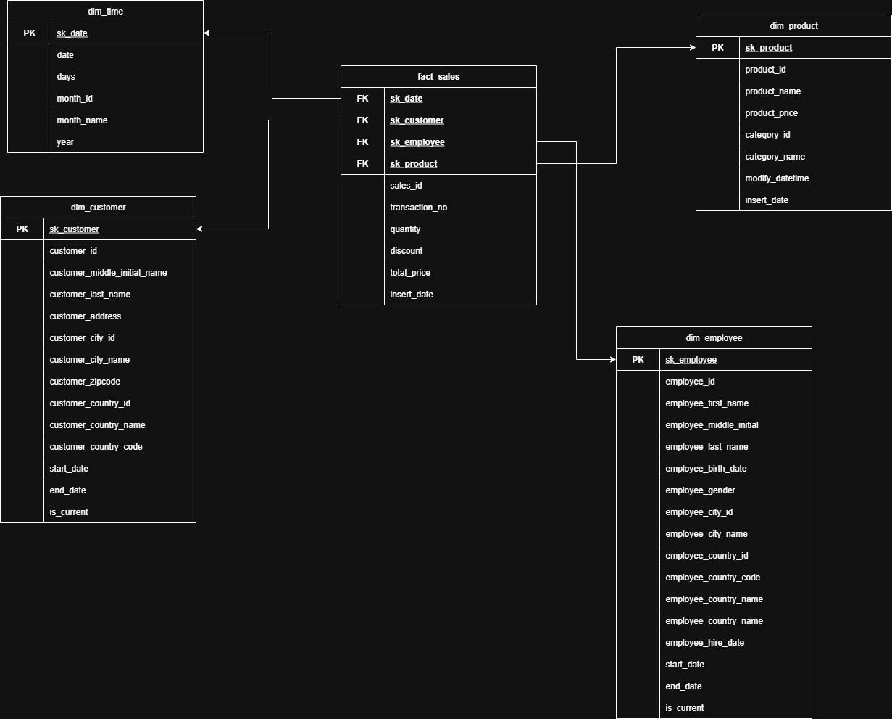
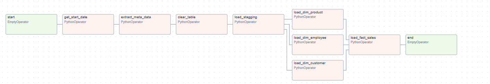
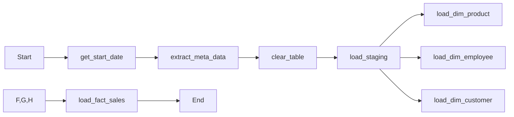
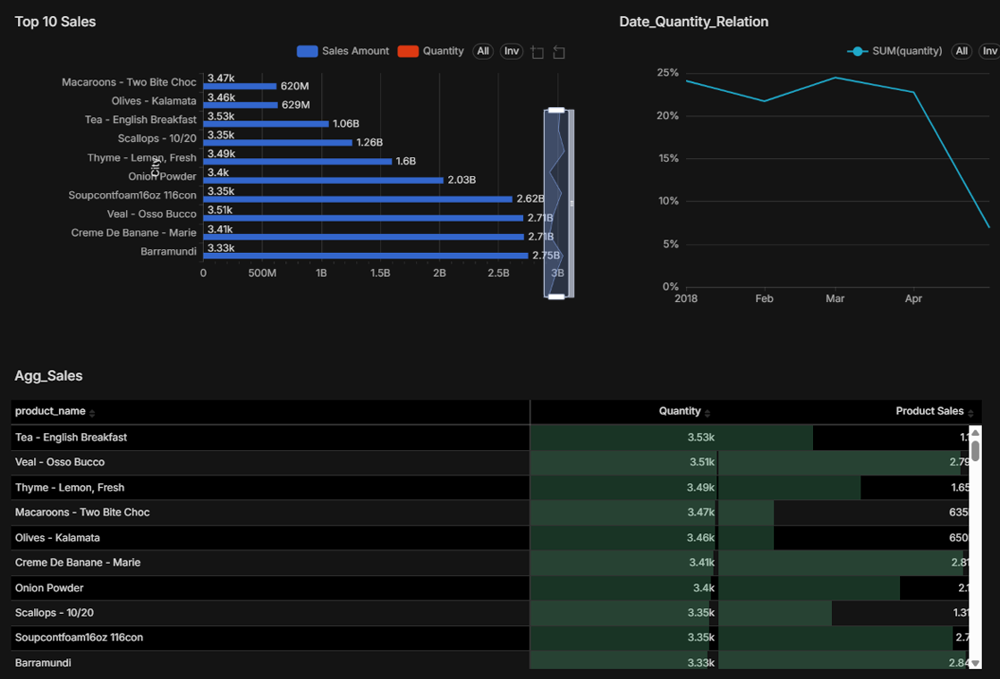

# 🚀 Sales Data Mart – Dimensional Model & ETL Pipeline

[](https://airflow.apache.org/)  
[](https://www.postgresql.org/)  


## 🔍 Project Overview
Proyek ini mensimulasikan pembangunan **ETL pipeline** untuk data warehouse berbasis PostgreSQL. Data mentah berasal dari file CSV yang kemudian diekstraksi, dibersihkan, ditransformasi, dan dimuat ke dalam model dimensional.  

- **Apache Airflow** digunakan sebagai orchestrator untuk mengatur dan menjadwalkan proses ETL.  
- **Pandas** dipakai untuk ekstraksi dan transformasi data dari CSV.  
- Data disimpan sementara di **schema staging** sebelum dimuat ke model dimensional yang terdiri dari **dimension tables** (dim_product, dim_customer, dim_employee, dim_time) serta **fact table** (fact_sales).  

Dengan setup ini, pipeline mampu menunjukkan alur nyata integrasi data — mulai dari ingest, transformasi, hingga siap digunakan untuk analisis bisnis.

---

## 🎯 Project Objectives
Langkah utama yang dilakukan dalam project ini:  
1. Mendesain mapping data dan ERD model Fact & Dimension (menggunakan draw.io).  
2. Membangun pipeline ETL dengan Apache Airflow.  
3. Membuat dashboard analitik menggunakan Apache Superset.  

---

## 📂 Input Data & Mapping
- Sumber data berupa **CSV** dengan struktur folder berdasarkan batch (`[YYYYMMDD]`).  
- Setiap folder berisi file tabel dengan nama `[YYYYMMDD].[SOURCE-TABLE].csv`.  
- **Improvement:**  
  - Menambahkan kolom `batch_id` pada setiap tabel staging untuk penanda batch.  
  - Pada dimension table dengan SCD2, ditambahkan `is_current` untuk flag data aktif, serta `insert_date` berdasarkan tanggal batch.  

📌 Contoh ERD hasil desain:  
<p align="center">
  
</p>

---

## 🗺️ ETL Flow
<p align="center">
  
</p>


### Ringkasan Alur:

1. Start → Trigger awal DAG.

2. Get Start Date → Menentukan batch/tanggal yang akan diproses.

3. Extract Meta Data → Membaca metadata (nama file, batch_id, header).

4. Clear Table → Membersihkan staging schema agar selalu fresh.

5. Load Staging → Load raw data CSV → PostgreSQL (schema staging).

6. Load Dimension Tables → Memperbarui dim_product, dim_employee, dim_customer (paralel). Dim_time sudah tersedia lebih dulu.

7. Load Fact Sales → Mengisi transaksi penjualan, join ke dimension table untuk surrogate keys, menghitung total_price, dan memastikan no-duplicate.

8. End → Proses ETL selesai.

### ⚠️ Catatan:

- Pipeline hanya memproses 1 batch folder per eksekusi.

- Untuk memuat semua batch, ETL perlu dijalankan lebih dari sekali.

- Jika file batch yang seharusnya diproses tidak tersedia, step dianggap gagal.

- Untuk merunning semua file batch yang tersedia perlu di lakukan secara berulang.

## 📊 Dashboard

Sebagai tahap akhir, hasil ETL divisualisasikan menggunakan Apache Superset.

<p align="center">  </p>

## ✅ Conclusion

Proyek ini berhasil menggambarkan bagaimana data warehouse pipeline dapat dibangun end-to-end:

- Data batch CSV diekstraksi, ditransformasi, dan dimuat ke PostgreSQL dalam bentuk dimensional model.

- Airflow mengatur orkestrasi ETL secara terjadwal, sementara Superset menyediakan insight visual dari fact & dimension.

- Dengan pendekatan ini, pipeline mampu menjaga konsistensi data, menghindari duplikasi, dan memastikan batch diproses secara berurutan.

👉 Project ini dapat menjadi pondasi untuk pengembangan lebih lanjut seperti:

- Automasi incremental load., streaming process dan sebagainya

- Quality check pada setiap step ETL.

- Deployment containerized (Docker/Podman) agar lebih portable.


## How to run
### Requirement :
    - Docker
    - Postgres

### Installation Step
1.  Clone Project
```
git clone https://github.com/nmhlog/mini_project.git
cd mini_project

```
2. Running Docker Compose untuk initialisasi airflow :
```
docker compose up -d
```
3. Running file db_migration.sql ke database yang anda inginkan.

4. tambahkan koneksi postgres_dwh
```
docker compose exec airflow-webserver airflow connections add 'postgres_dwh' --conn-type 'postgres' --conn-host '<HOST>' --conn-login '<USER>' --conn-password '<PASSWORD>' --conn-schema '<SCHEMA>' --conn-port 5432
```